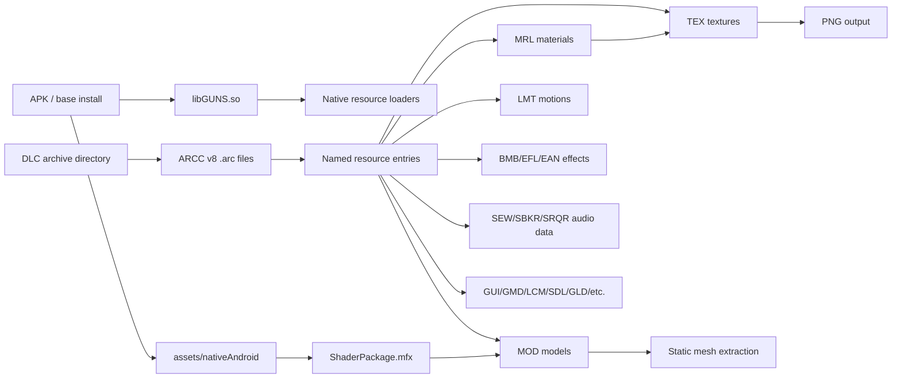
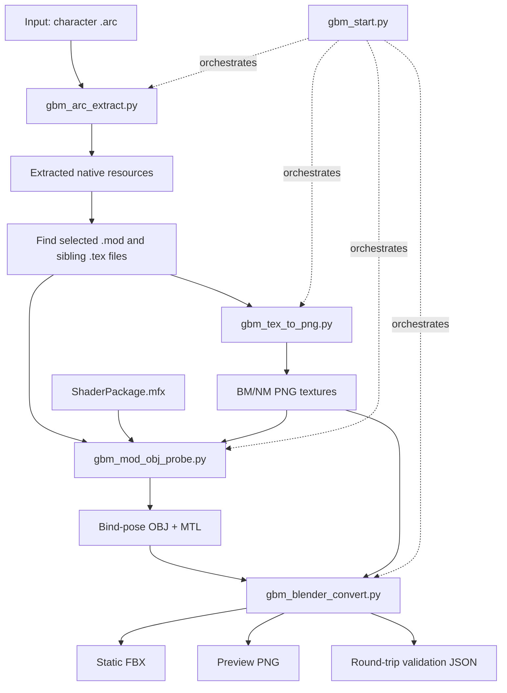
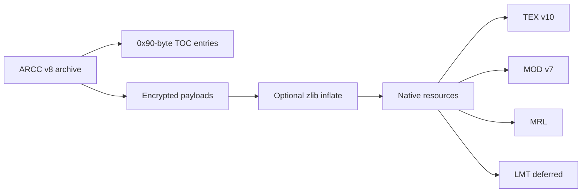

# GBM-Research

Static asset extraction research and tools for **Gundam Breaker Mobile**
Android resources.

[](LICENSE)
[](https://www.python.org/)
[](https://www.blender.org/)

> This repository contains research notes and extraction/conversion tools only.
> It does not include game archives, APKs, extracted assets, textures, models,
> or other copyrighted game data.

## What This Project Does

Reproducible static extraction pipeline:

```text
GBM DLC .arc
  -> decrypted and decompressed native resources
  -> TEX textures converted to PNG
  -> MOD bind-pose geometry exported to OBJ
  -> OBJ plus PNG textures converted to static FBX with Blender
```

The validated sample path is `ch/320900.arc` (1 mesh, 52,667 vertices, 44,867
polygons). Animation research is deferred; LMT notes are retained as context only.

## Table of Contents

**Getting started**

- [Requirements](#requirements)
- [Quick Start](#quick-start)
- [One-Command Tool: `gbm_start.py`](#one-command-tool-gbm_startpy)
- [Manual Stage Commands](#manual-stage-commands)
- [Individual Tool Summary](#individual-tool-summary)

**Reference**

- [Repository Layout](#repository-layout)
- [High-Level Game Resource Architecture](#high-level-game-resource-architecture)
- [Extraction Pipeline Architecture](#extraction-pipeline-architecture)
- [Orientation Notes](#orientation-notes)
- [Format Notes](#format-notes)
- [Validation Strategy](#validation-strategy)
- [Legal and Asset Handling](#legal-and-asset-handling)
- [License](#license)

---

## Requirements

Python:

```powershell
python --version
python -m pip install pycryptodome pillow texture2ddecoder
```

Blender is required for FBX export and preview rendering. Blender 4.2 was used
for validation:

```text
C:\Program Files\Blender Foundation\Blender 4.2\blender.exe
```

The Python tools can still produce extracted resources, PNGs, and OBJ files
without Blender by passing `--skip-fbx` to `gbm_start.py`.

The static model decoder also needs `ShaderPackage.mfx`. `gbm_start.py` uses
`tools/ShaderPackage.mfx` by default. If that file is missing, copy it from the
extracted APK or pass `--mfx <path>` explicitly.

Input is a local GBM `.arc` archive (for example `ch/12235.arc`). This
repository does not include game archives.

Generated output should go under `out/`, which is ignored by Git.

## Quick Start

Run from the repository root:

```powershell
cd E:\research\Gundam_Breaker_Mobile\GBM-Research
```

**One-command static extraction:**

```powershell
python .\tools\gbm_start.py `
  E:\research\Gundam_Breaker_Mobile\com.bandainamcoent.gb_jp\files\dlc\archive\ch\12235.arc `
  -o .\out\12235
```

You usually only know the `.arc` filename (for example `12235.arc` or
`320900.arc`), not the internal model stems inside it (for example `chr122350` or
`ma320900`). Do not pass `--model-stem` unless you already know the exact stem
from a prior run or from `extracted/_manifest.json`.

By default, `gbm_start.py` exports every discovered `.mod` under
`out/<arc-stem>/models/<unique-model-name>/...`.

Expected output layout:

```text
out/12235/
  extracted/
    _manifest.json
    ...
  models/
    chr122350/
      png/
        _tex_manifest.json
        chr122350_BM.png
        chr122350_NM.png
      obj/
        chr122350.obj
        chr122350.mtl
        chr122350_obj_manifest.json
      fbx/
        chr122350.fbx
        chr122350_BM.png
        chr122350_NM.png
        chr122350_preview.png
        chr122350_fbx_report.json
    chr122351/
      ...
```

If multiple `.mod` files share the same stem, later folders are suffixed as
`__2`, `__3`, and so on.

**Preview without writing files:**

```powershell
python .\tools\gbm_start.py `
  E:\research\Gundam_Breaker_Mobile\com.bandainamcoent.gb_jp\files\dlc\archive\ch\12235.arc `
  -o .\out\12235 `
  --dry-run
```

**Stop before FBX export (no Blender needed):**

```powershell
python .\tools\gbm_start.py `
  E:\research\Gundam_Breaker_Mobile\com.bandainamcoent.gb_jp\files\dlc\archive\ch\12235.arc `
  -o .\out\12235 `
  --skip-fbx
```

**Custom Blender executable:**

```powershell
python .\tools\gbm_start.py `
  E:\research\Gundam_Breaker_Mobile\com.bandainamcoent.gb_jp\files\dlc\archive\ch\12235.arc `
  -o .\out\12235 `
  --blender 'D:\Tools\Blender\blender.exe'
```

**Find archives by unit name** (e.g. `RX-78-2`): see
[RESOURCE_NAME_MAPPING.md](RESOURCE_NAME_MAPPING.md) or start with
`tools/gbm_archive_lookup_index.csv`.

---

## One-Command Tool: `gbm_start.py`

`gbm_start.py` is the recommended entry point. It orchestrates the focused tools
in sequence without duplicating format logic.

```text
gbm_start.py
  1. calls gbm_arc_extract.py
  2. reads the extraction manifest
  3. exports every discovered MOD (or one MOD when `--model-stem` is provided)
  4. calls gbm_tex_to_png.py on the MOD directory
  5. calls gbm_mod_obj_probe.py
  6. optionally calls Blender with gbm_blender_convert.py
```

Options:

| Option | Required | Meaning |
|---|---:|---|
| `arc` | yes | Input GBM `.arc` archive |
| `--mfx` | no | Override `ShaderPackage.mfx`; defaults to `tools/ShaderPackage.mfx` |
| `-o`, `--output` | no | Output root; defaults to `out/<arc-stem>` |
| `--model-stem` | no | Optional. Restrict export to one known model stem. Omit this in normal use: you usually only have the `.arc` name, not internal stems like `ma320900`. Check `extracted/_manifest.json` after the first run if you need the exact names |
| `--limit` | no | Extract only the first N archive entries |
| `--blender` | no | Blender executable path |
| `--skip-fbx` | no | Stop after PNG and OBJ output |
| `--dry-run` | no | Print planned commands and paths |

## Manual Stage Commands

Use these when investigating a failure in one stage. The examples below use
`ma320900` paths from the validated `320900.arc` sample; after your own
extraction, read `extracted/_manifest.json` to find the real model paths inside
that archive.

### 1. Extract ARCC

```powershell
python .\tools\gbm_arc_extract.py `
  ..\com.bandainamcoent.gb_jp\files\dlc\archive\ch\320900.arc `
  -o .\out\320900\extracted `
  --manifest .\out\320900\extracted\_manifest.json
```

### 2. Convert TEX to PNG

```powershell
python .\tools\gbm_tex_to_png.py `
  .\out\320900\extracted\character\ma320900\mod `
  -o .\out\320900\png `
  --manifest .\out\320900\png\_tex_manifest.json
```

### 3. Export OBJ

```powershell
python .\tools\gbm_mod_obj_probe.py `
  .\out\320900\extracted\character\ma320900\mod\ma320900.mod `
  -o .\out\320900\obj `
  --texture .\out\320900\png\ma320900_BM.png `
  --position-mode bind-pose `
  --axis-mode engine `
  --manifest .\out\320900\obj\ma320900_obj_manifest.json
```

### 4. Export FBX

```powershell
& 'C:\Program Files\Blender Foundation\Blender 4.2\blender.exe' `
  --background `
  --python .\tools\gbm_blender_convert.py -- `
  --input-obj .\out\320900\obj\ma320900.obj `
  --output-fbx .\out\320900\fbx\ma320900.fbx `
  --texture .\out\320900\png\ma320900_BM.png `
  --normal-texture .\out\320900\png\ma320900_NM.png `
  --preview .\out\320900\fbx\ma320900_preview.png `
  --report .\out\320900\fbx\ma320900_fbx_report.json
```

Do not pass `--lmt`, `--motion-index`, or `--preview-frame` for the current
static extraction milestone.

## Individual Tool Summary

| Tool | Purpose | Main output |
|---|---|---|
| `tools/gbm_start.py` | Orchestrates the stable static pipeline | output directory tree |
| `tools/gbm_arc_extract.py` | Decrypts/decompresses ARCC v8 archives | extracted native resources |
| `tools/gbm_tex_to_png.py` | Converts TEX v10 textures | PNG files |
| `tools/gbm_mod_obj_probe.py` | Exports MOD v7 bind-pose geometry | OBJ, MTL, manifest |
| `tools/gbm_blender_convert.py` | Converts OBJ/PNG to static FBX in Blender | FBX, preview, report |
| `tools/gbm_mod_inspect.py` | Inspects MOD structure | JSON report |
| `tools/gbm_mfx_inspect.py` | Inspects MFX input layouts | JSON report |
| `tools/gbm_lmt_inspect.py` | Inspects deferred LMT motion files | JSON report |
| `tools/gbm_equip_lookup.py` | Looks up serial names such as `RX-78-2` | `model_id` and matching `ch/*.arc` variants |

Detailed tool notes live in [TOOLS_REFERENCE.md](TOOLS_REFERENCE.md).

---

## Repository Layout

```text
GBM-Research/
  README.md
  LICENSE
  .gitignore
  tools/
    gbm_start.py             # one-command static pipeline orchestrator
    gbm_arc_extract.py       # ARCC v8 extraction
    gbm_tex_to_png.py        # TEX v10 to PNG conversion
    gbm_mod_obj_probe.py     # MOD v7 bind-pose OBJ export
    gbm_blender_convert.py   # OBJ/PNG to static FBX through Blender
    gbm_mod_inspect.py       # MOD structure inspector
    gbm_mfx_inspect.py       # MFX input-layout inspector
    gbm_lmt_inspect.py       # deferred LMT motion inspector
    gbm_equip_lookup.py      # serial_name/model_id lookup for ch archives
    gbm_archive_lookup_index.csv # human-readable serial_name -> model_id index
    gbm_equip_parts_index.csv    # complete part-level equip table index
    ShaderPackage.mfx        # required for MOD vertex layout decoding
  STATUS_STATIC_EXTRACTION.md
  STATIC_EXTRACTION_PIPELINE.md
  ARCC_V8_ARCHIVE.md
  TEX_V10_TEXTURES.md
  MOD_V7_MODEL.md
  MRL_MFX_MATERIALS.md
  RESOURCE_FORMAT_CATALOG.md
  RESOURCE_NAME_MAPPING.md
  VALIDATION_320900.md
  TOOLS_REFERENCE.md
  IDA_EVIDENCE.md
  LMT_ANIMATION_DEFERRED.md
  GBM_ARC_RESEARCH.md
```

`tools/ShaderPackage.mfx` is the default shader package used for MOD vertex
layout decoding.

## High-Level Game Resource Architecture

GBM uses encrypted DLC archives plus native MT-framework-style resource files
loaded by `libGUNS.so`.



The static model path only needs these formats:

| Layer | Format | Role |
|---|---|---|
| Archive | `ARCC` `.arc` | Encrypted DLC resource container |
| Texture | `TEX ` `.tex` | BM/NM texture payloads |
| Model | `MOD\0` `.mod` | Geometry, primitives, buffers, skeleton context |
| Material | `MRL\0` `.mrl` | Material and texture references |
| Shader package | `MFX\0` `.mfx` | Vertex input layouts needed to decode MOD buffers |
| Output | `.png`, `.obj`, `.fbx` | Research/DCC-friendly extraction outputs |

See [RESOURCE_FORMAT_CATALOG.md](RESOURCE_FORMAT_CATALOG.md) for the broader
format list.
See [RESOURCE_NAME_MAPPING.md](RESOURCE_NAME_MAPPING.md) for finding numeric
`ch/*.arc` files from names such as `RX-78-2`; start with
`tools/gbm_archive_lookup_index.csv`. The lookup CSV rows follow the source
order from `table_body.etb`; they are not alphabetically sorted by
`serial_name`.

## Extraction Pipeline Architecture



The lower-level tools remain available for debugging each stage.

## Orientation Notes

`gbm_start.py` keeps the intermediate OBJ in engine basis and lets
`gbm_blender_convert.py` own the DCC-axis correction for FBX export.

- Raw OBJ imported into Blender with the default OBJ importer usually appears
  with `rotation = (90, 0, 0)`. For a front-facing inspection view, add
  `Z = +90` after import or use custom OBJ import axes. This is currently a DCC
  import convention, not proof that the source MOD stores non-zero object
  transforms.
- FBX export now keeps the top-level hierarchy flat as `<model>` plus
  `<model>_armature`; it no longer inserts a helper empty such as
  `<model>_export_root`.
- The current Blender FBX export preset is `Use Space Transform = True`,
  `Bake Space Transform = False`, `Forward = Z`, `Up = Y`,
  `Primary Bone Axis = -X`, and `Secondary Bone Axis = Y`.
- These FBX export settings are written into `*_fbx_report.json` as
  `fbx_export_settings` so Maya-facing orientation changes stay auditable.
- Bone rest orientation is still driven directly from the imported bind
  matrices. The exporter does not add a helper root or inject a fixed
  `Bone_000` rest rotation on top of the decoded MOD bind pose.

## Format Notes



Key documents:

| Topic | Document |
|---|---|
| Current state | [STATUS_STATIC_EXTRACTION.md](STATUS_STATIC_EXTRACTION.md) |
| Pipeline commands | [STATIC_EXTRACTION_PIPELINE.md](STATIC_EXTRACTION_PIPELINE.md) |
| Archive format | [ARCC_V8_ARCHIVE.md](ARCC_V8_ARCHIVE.md) |
| Texture format | [TEX_V10_TEXTURES.md](TEX_V10_TEXTURES.md) |
| Model format | [MOD_V7_MODEL.md](MOD_V7_MODEL.md) |
| Materials and shader layouts | [MRL_MFX_MATERIALS.md](MRL_MFX_MATERIALS.md) |
| Format catalog | [RESOURCE_FORMAT_CATALOG.md](RESOURCE_FORMAT_CATALOG.md) |
| Resource name mapping | [RESOURCE_NAME_MAPPING.md](RESOURCE_NAME_MAPPING.md) |
| Validation sample | [VALIDATION_320900.md](VALIDATION_320900.md) |
| Native reverse engineering anchors | [IDA_EVIDENCE.md](IDA_EVIDENCE.md) |
| Deferred animation notes | [LMT_ANIMATION_DEFERRED.md](LMT_ANIMATION_DEFERRED.md) |
| Full historical log | [GBM_ARC_RESEARCH.md](GBM_ARC_RESEARCH.md) |

## Validation Strategy

The FBX export stage writes `*_fbx_report.json`. Treat this report as the
primary validation artifact.

The report records:

- input OBJ path;
- output FBX path;
- FBX exporter transform and bone-axis settings;
- copied texture paths;
- source scene topology;
- re-imported FBX topology;
- rendered preview path.

For the validated `ma320900` sample, source and re-imported FBX preserve the
same vertex, polygon, loop, and material counts.

## Legal and Asset Handling

This repository is for interoperability and research tooling. It does not grant
rights to Gundam Breaker Mobile assets.

Do not commit generated extraction output:

- `.arc` archives;
- APK files;
- extracted TEX/MOD/MRL/LMT resources;
- generated PNG/OBJ/FBX files;
- other copyrighted game assets.

The `.gitignore` file is configured to exclude common generated and raw asset
extensions.

## License

The code and documentation in this repository are released under the MIT
License. See [LICENSE](LICENSE).

The MIT License applies only to this repository's original code and research
notes. It does not apply to third-party game files, extracted assets, game
metadata, trademarks, or other external copyrighted material.
