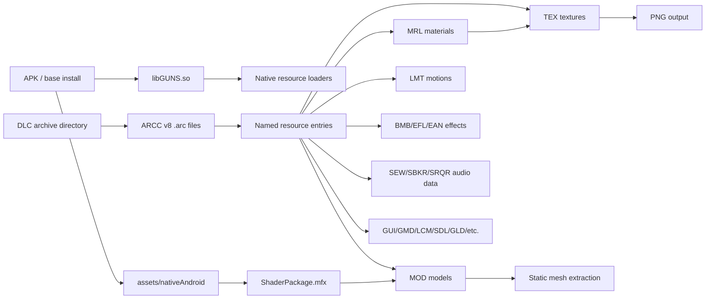
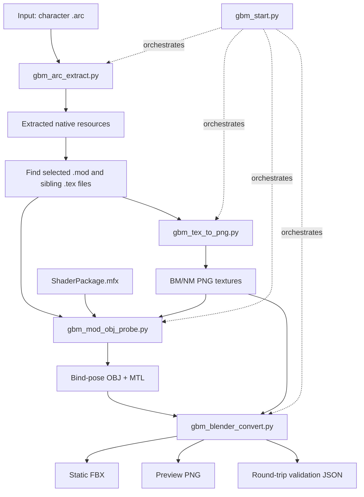
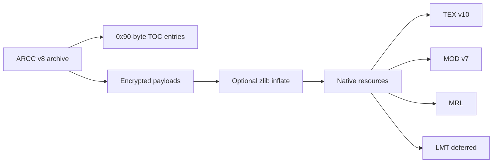

# GBM-Research

Static asset extraction research and tools for **Gundam Breaker Mobile**
Android resources.

[](LICENSE)
[](https://www.python.org/)
[](https://www.blender.org/)

> This repository contains research notes and extraction/conversion tools only.
> It does not include game archives, APKs, extracted assets, textures, models,
> or other copyrighted game data.

## What This Project Does

The current milestone is a reproducible static extraction pipeline:

```text
GBM DLC .arc
  -> decrypted and decompressed native resources
  -> TEX textures converted to PNG
  -> MOD bind-pose geometry exported to OBJ
  -> OBJ plus PNG textures converted to static FBX with Blender
```

The validated sample path is `ch/320900.arc`, which produces a textured static
model with:

| Metric | Validated value |
|---|---:|
| Meshes | 1 |
| Vertices | 52,667 |
| Polygons | 44,867 |
| Loops | 134,601 |
| Material | practical BM/NM Blender material |

Animation research is currently deferred. LMT notes are retained as reverse
engineering context, but LMT-to-FBX animation is not part of the stable static
pipeline.

## Repository Layout

```text
GBM-Research/
  README.md
  LICENSE
  .gitignore
  tools/
    gbm_start.py             # one-command static pipeline orchestrator
    gbm_arc_extract.py       # ARCC v8 extraction
    gbm_tex_to_png.py        # TEX v10 to PNG conversion
    gbm_mod_obj_probe.py     # MOD v7 bind-pose OBJ export
    gbm_blender_convert.py   # OBJ/PNG to static FBX through Blender
    gbm_mod_inspect.py       # MOD structure inspector
    gbm_mfx_inspect.py       # MFX input-layout inspector
    gbm_lmt_inspect.py       # deferred LMT motion inspector
    ShaderPackage.mfx        # required for MOD vertex layout decoding
  STATUS_STATIC_EXTRACTION.md
  STATIC_EXTRACTION_PIPELINE.md
  ARCC_V8_ARCHIVE.md
  TEX_V10_TEXTURES.md
  MOD_V7_MODEL.md
  MRL_MFX_MATERIALS.md
  RESOURCE_FORMAT_CATALOG.md
  VALIDATION_320900.md
  TOOLS_REFERENCE.md
  IDA_EVIDENCE.md
  LMT_ANIMATION_DEFERRED.md
  GBM_ARC_RESEARCH.md
```

Expected local game-data directories live outside this repository:

```text
../com.bandainamcoent.gb_jp/
../gundam-breaker-mobile-4-01-03/
```

Generated output should go under `out/`, which is ignored by Git.
`tools/ShaderPackage.mfx` is the default shader package used for MOD vertex
layout decoding.

## High-Level Game Resource Architecture

GBM uses encrypted DLC archives plus native MT-framework-style resource files
loaded by `libGUNS.so`.



The static model path only needs these formats:

| Layer | Format | Role |
|---|---|---|
| Archive | `ARCC` `.arc` | Encrypted DLC resource container |
| Texture | `TEX ` `.tex` | BM/NM texture payloads |
| Model | `MOD\0` `.mod` | Geometry, primitives, buffers, skeleton context |
| Material | `MRL\0` `.mrl` | Material and texture references |
| Shader package | `MFX\0` `.mfx` | Vertex input layouts needed to decode MOD buffers |
| Output | `.png`, `.obj`, `.fbx` | Research/DCC-friendly extraction outputs |

See [RESOURCE_FORMAT_CATALOG.md](RESOURCE_FORMAT_CATALOG.md) for the broader
format list.

## Extraction Pipeline Architecture



The recommended user-facing entry point is `tools/gbm_start.py`. The lower-level
tools remain available for debugging each stage.

## Requirements

Python:

```powershell
python --version
python -m pip install pycryptodome pillow texture2ddecoder
```

Blender is required for FBX export and preview rendering. Blender 4.2 was used
for validation:

```text
C:\Program Files\Blender Foundation\Blender 4.2\blender.exe
```

The Python tools can still produce extracted resources, PNGs, and OBJ files
without Blender by passing `--skip-fbx` to `gbm_start.py`.

The static model decoder also needs `ShaderPackage.mfx`. `gbm_start.py` uses
`tools/ShaderPackage.mfx` by default. If that file is missing, copy it from the
extracted APK or pass `--mfx <path>` explicitly.

## Quick Start

Run from the repository root:

```powershell
cd E:\research\Gundam_Breaker_Mobile\GBM-Research
```

One-command static extraction:

```powershell
python .\tools\gbm_start.py `
  ..\com.bandainamcoent.gb_jp\files\dlc\archive\ch\320900.arc `
  --model-stem ma320900 `
  -o .\out\320900 `
  --force
```

Expected output layout:

```text
out/320900/
  extracted/
    _manifest.json
    character/ma320900/mod/ma320900_BM.tex
    character/ma320900/mod/ma320900_NM.tex
    character/ma320900/mod/ma320900.mrl
    character/ma320900/mod/ma320900.mod
  png/
    ma320900_BM.png
    ma320900_NM.png
    _tex_manifest.json
  obj/
    ma320900.obj
    ma320900.mtl
    ma320900_obj_manifest.json
  fbx/
    ma320900.fbx
    ma320900_BM.png
    ma320900_NM.png
    ma320900_preview.png
    ma320900_fbx_report.json
```

Preview commands without writing files:

```powershell
python .\tools\gbm_start.py `
  ..\com.bandainamcoent.gb_jp\files\dlc\archive\ch\320900.arc `
  --model-stem ma320900 `
  -o .\out\320900 `
  --dry-run
```

Stop before FBX export:

```powershell
python .\tools\gbm_start.py `
  ..\com.bandainamcoent.gb_jp\files\dlc\archive\ch\320900.arc `
  --model-stem ma320900 `
  -o .\out\320900 `
  --skip-fbx
```

Use a custom Blender executable:

```powershell
python .\tools\gbm_start.py `
  ..\com.bandainamcoent.gb_jp\files\dlc\archive\ch\320900.arc `
  --model-stem ma320900 `
  --blender 'D:\Tools\Blender\blender.exe' `
  -o .\out\320900
```

## One-Command Tool: `gbm_start.py`

`gbm_start.py` is a thin orchestrator. It does not duplicate format logic; it
calls the focused tools in sequence.

```text
gbm_start.py
  1. calls gbm_arc_extract.py
  2. reads the extraction manifest
  3. selects a MOD file
  4. calls gbm_tex_to_png.py on the MOD directory
  5. calls gbm_mod_obj_probe.py
  6. optionally calls Blender with gbm_blender_convert.py
```

Options:

| Option | Required | Meaning |
|---|---:|---|
| `arc` | yes | Input GBM `.arc` archive |
| `--mfx` | no | Override `ShaderPackage.mfx`; defaults to `tools/ShaderPackage.mfx` |
| `-o`, `--output` | no | Output root; defaults to `out/<arc-stem>` |
| `--model-stem` | no | Prefer a specific model stem, such as `ma320900` |
| `--limit` | no | Extract only the first N archive entries |
| `--blender` | no | Blender executable path |
| `--skip-fbx` | no | Stop after PNG and OBJ output |
| `--force` | no | Delete the selected output root before running |
| `--dry-run` | no | Print planned commands and paths |

`--force` only deletes inside the current repository. It refuses to delete the
repository root or paths outside the repository.

## Manual Stage Commands

Use these when investigating a failure in one stage.

### 1. Extract ARCC

```powershell
python .\tools\gbm_arc_extract.py `
  ..\com.bandainamcoent.gb_jp\files\dlc\archive\ch\320900.arc `
  -o .\out\320900\extracted `
  --manifest .\out\320900\extracted\_manifest.json
```

### 2. Convert TEX to PNG

```powershell
python .\tools\gbm_tex_to_png.py `
  .\out\320900\extracted\character\ma320900\mod `
  -o .\out\320900\png `
  --manifest .\out\320900\png\_tex_manifest.json
```

### 3. Export OBJ

```powershell
python .\tools\gbm_mod_obj_probe.py `
  .\out\320900\extracted\character\ma320900\mod\ma320900.mod `
  -o .\out\320900\obj `
  --texture .\out\320900\png\ma320900_BM.png `
  --position-mode bind-pose `
  --axis-mode blender `
  --manifest .\out\320900\obj\ma320900_obj_manifest.json
```

### 4. Export FBX

```powershell
& 'C:\Program Files\Blender Foundation\Blender 4.2\blender.exe' `
  --background `
  --python .\tools\gbm_blender_convert.py -- `
  --input-obj .\out\320900\obj\ma320900.obj `
  --output-fbx .\out\320900\fbx\ma320900.fbx `
  --texture .\out\320900\png\ma320900_BM.png `
  --normal-texture .\out\320900\png\ma320900_NM.png `
  --preview .\out\320900\fbx\ma320900_preview.png `
  --report .\out\320900\fbx\ma320900_fbx_report.json
```

Do not pass `--lmt`, `--motion-index`, or `--preview-frame` for the current
static extraction milestone.

## Individual Tool Summary

| Tool | Purpose | Main output |
|---|---|---|
| `tools/gbm_start.py` | Orchestrates the stable static pipeline | output directory tree |
| `tools/gbm_arc_extract.py` | Decrypts/decompresses ARCC v8 archives | extracted native resources |
| `tools/gbm_tex_to_png.py` | Converts TEX v10 textures | PNG files |
| `tools/gbm_mod_obj_probe.py` | Exports MOD v7 bind-pose geometry | OBJ, MTL, manifest |
| `tools/gbm_blender_convert.py` | Converts OBJ/PNG to static FBX in Blender | FBX, preview, report |
| `tools/gbm_mod_inspect.py` | Inspects MOD structure | JSON report |
| `tools/gbm_mfx_inspect.py` | Inspects MFX input layouts | JSON report |
| `tools/gbm_lmt_inspect.py` | Inspects deferred LMT motion files | JSON report |

Detailed tool notes live in [TOOLS_REFERENCE.md](TOOLS_REFERENCE.md).

## Format Notes



Key documents:

| Topic | Document |
|---|---|
| Current state | [STATUS_STATIC_EXTRACTION.md](STATUS_STATIC_EXTRACTION.md) |
| Pipeline commands | [STATIC_EXTRACTION_PIPELINE.md](STATIC_EXTRACTION_PIPELINE.md) |
| Archive format | [ARCC_V8_ARCHIVE.md](ARCC_V8_ARCHIVE.md) |
| Texture format | [TEX_V10_TEXTURES.md](TEX_V10_TEXTURES.md) |
| Model format | [MOD_V7_MODEL.md](MOD_V7_MODEL.md) |
| Materials and shader layouts | [MRL_MFX_MATERIALS.md](MRL_MFX_MATERIALS.md) |
| Format catalog | [RESOURCE_FORMAT_CATALOG.md](RESOURCE_FORMAT_CATALOG.md) |
| Validation sample | [VALIDATION_320900.md](VALIDATION_320900.md) |
| Native reverse engineering anchors | [IDA_EVIDENCE.md](IDA_EVIDENCE.md) |
| Deferred animation notes | [LMT_ANIMATION_DEFERRED.md](LMT_ANIMATION_DEFERRED.md) |
| Full historical log | [GBM_ARC_RESEARCH.md](GBM_ARC_RESEARCH.md) |

## Validation Strategy

The FBX export stage writes `*_fbx_report.json`. Treat this report as the
primary validation artifact.

The report records:

- input OBJ path;
- output FBX path;
- copied texture paths;
- source scene topology;
- re-imported FBX topology;
- rendered preview path.

For the validated `ma320900` sample, source and re-imported FBX preserve the
same vertex, polygon, loop, and material counts.

## Legal and Asset Handling

This repository is for interoperability and research tooling. It does not grant
rights to Gundam Breaker Mobile assets.

Do not commit generated extraction output:

- `.arc` archives;
- APK files;
- extracted TEX/MOD/MRL/LMT resources;
- generated PNG/OBJ/FBX files;
- other copyrighted game assets.

The `.gitignore` file is configured to exclude common generated and raw asset
extensions.

## License

The code and documentation in this repository are released under the MIT
License. See [LICENSE](LICENSE).

The MIT License applies only to this repository's original code and research
notes. It does not apply to third-party game files, extracted assets, game
metadata, trademarks, or other external copyrighted material.
